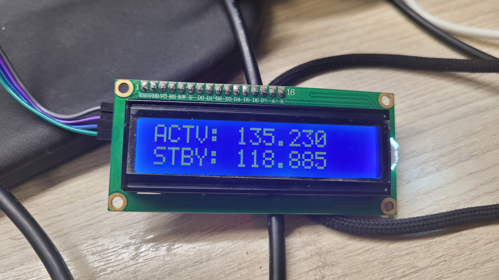
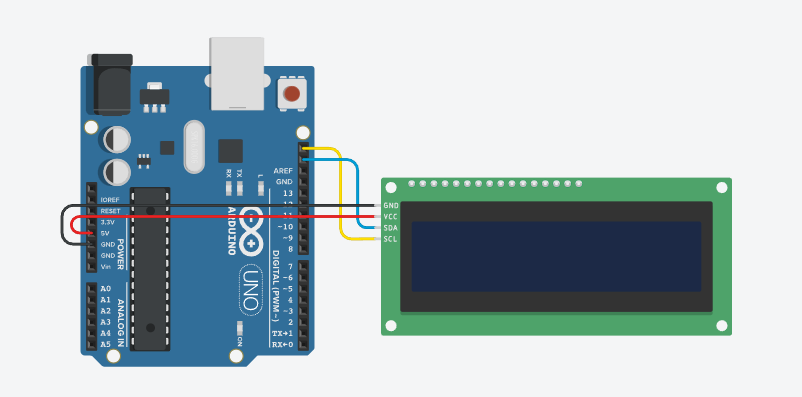
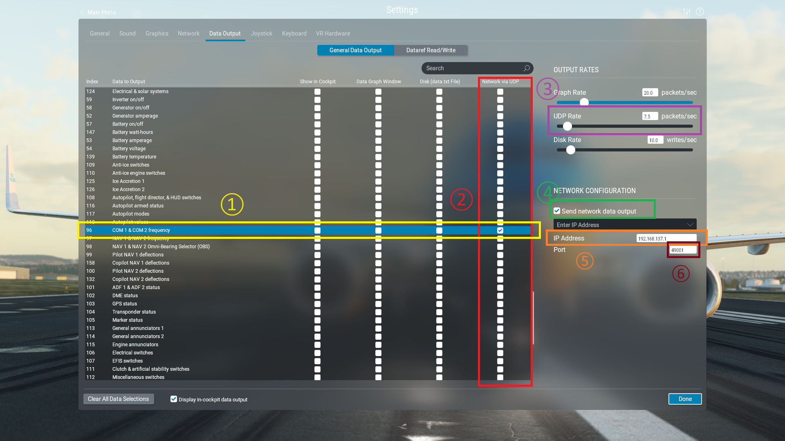
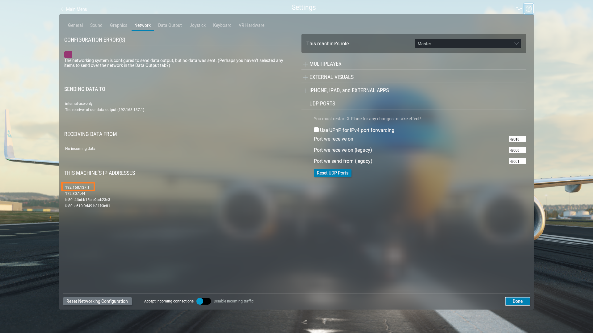

# XP12 Frequency Panel
This project shows the COM and NAV frequency in XP12 in a 16*2 LCD connected to an Arduino Uno.



## Requirements
- XPlane 12 (not checked on XP11 or lower)
- Arduino Uno (any type of Arduino is OK) and USB cable
- 4 male-female jumper cables
- 16*2 LCD with I2C interface
- Node.js (tested on 20.11.1 but any other version could work)
- Arduino IDE with `liquidcrystal_i2c.h` installed(for uploading code on arduino)

## Circuit



## Installation

Download Node.js from [here](https://nodejs.org/en)

Open the command prompt, and type:

```
> git clone https://github.com/sw08/xp12-frequency-panel.git
> cd xp12-frequency-panel
> npm i
```

Before we run the program, we need to setup XP12.



1. Find `COM 1 & COM 2 frequency` indexed 96 (97 if you want NAV frequency, not COM frequency)
2. Check the `Network via UDP` checkbox, which is the last in the row.
3. Set `UDP Rate` to around 7~8. This may vary depending on the performance of the arduino and your computer.
4. Check `Send network data output` checkbox.
5. Set `IP Address` to the ip of your computer which you can find in the Network settings as below.

6. Set `Port` to d available one, for example 49001.

After finishing circuit, connect the arduino to your computer and find the usb port (for me it was `COM8`) it's connected to. With Arduino IDE, compile and upload `freqPanel.ino` onto your Arduino in `arduino` directory.

Lastly, open the `index.js` in `xp12-frequency-panel` directory, and change the serial port and udp port to what you set/found right before.

```
> node index.js
```

Now if you load XP12, you can see the LCD displaying COM1 active/stanby frequency.

Also, by commenting/uncommenting L40~L47 in `index.js` and editing L48/L49, you can change the displayed frequencies to COM2, NAV1 or NAV2.

## License

This project is under the [MIT license](./LICENSE)